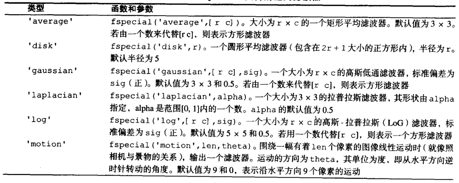

#第三章 灰度变换与空间滤波(Matlab)
##一：灰度变换
###1.1 灰度变换基础
实现灰度变换的基本Matlab函数：  
  
此函数将图像f的亮度值映射到g中的新值，及将low_in至high_in之间的值映射到low_out至high_out之间的值。 **所有输入输出均指定在0和1之间**。  
gamma指定了映射形状：  
  

###1.2 灰度变换实践 
**nargin:** 输入参数数目；  
**nargout:** 输出参数数目；  
**varargin:** 输入参数数组；  
**varargout:** 输出参数数组。    

程序文件: **changeclass.m, intrans.m** 实现：    
1. 图像反转；  
2. 对数变换；  
3. 伽马变换；  
4. 对比度拉伸。  
  
##二：直方图处理与函数绘图
###2.1 直方图绘制
	
	// imhist方法
	h = imhist(f,b);
	
	// bar方法
	h = imhist(f);
	h1 = h(1:10:256);
	horz = 1:10:256;
	bar(horz,h1)
	axis([0 255 0 15000])
	set(gca,'xtick',0:50:255)
	set(gca,'ytick',0:2000:15000)
	
	// stem方法
	h = imhist(f);
	h1 = h(1:10:256);
	horz = 1:10:256;
	stem(horz,h1,'fill')
	axis([0 255 0 15000])
	set(gca,'xtick',0:50:255)
	set(gca,'ytick',0:2000:15000)
	
	// plot方法
	h = imhist(f);
	plot(h)	% Use the default values
	axis([0 255 0 15000])
	set(gca,'xtick',0:50:255)
	set(gca,'ytick',0:2000:15000)
  
###2.2 直方图均衡
	
	// histeq实现直方图均衡
	imshow(f);
	figure,imhist(f)
	ylim('auto')
	g = histeq(f,256);
	figure,imshow(g)
	figure,imhist(g)
	ylim('auto')
	
获得直方图均衡的变换函数(CDF)：  
	
	hnorm = imhist(f)./numel(f);
	cdf = cumsum(hnorm);
	x = linespace(0,1,256);
	plot(x,cdf)
	set(gca,'xtick',0:.2:1)
	set(gca,'ytick',0:.2:1)
	xlabel('Input intensity values','fontsize',9)
	ylabel('Output intensity values','fontsize',9)
	text(0.18,0.5,'Transformation function','fontsize',9)
	
###2.3 直方图匹配
参考程序文件：**twomodegauss.m, manualhist.m** 。  
  
##三：空间滤波
###3.1 线性空间滤波
	
	g = imfilter(f,w,filtering_mode,boundary_options,size_options);
	filtering_mode: 
		'corr' - 滤波通过使用相关来完成；
		'conv' - 滤波通过使用卷积来完成(模板需要翻转180度)；
	boundary_options：
		P - 输入图像的边界通过用值P来填充来扩展，P默认为0；
		'replicate' - 图像大小通过复制外边界的值来扩展；
		'symmetric' - 图像大小通过镜像反射其边界来扩展；
		'circular' - 图像大小通过将图像看出是一个二维周期函数的一个周期来扩展；
	size_options：
		'full' - 输出图像的大小与被扩展图像的大小相同；
		'same' - 输出图像的大小与输入图像的大小相同。  

	Eg:
		g = imfilter(f,w,'replicate');
		g = imfilter(f,w,'conv','replicate');
  
###3.2 非线性空间滤波
非线性滤波之前，输入图像必须经过填充，可以使用：  
	
	fp = padarray(f,[r c],method,direction);
	method:
		'symmetric' - 图像大小通过围绕边界进行镜像反射来扩展；
		'replicate' - 图像大小通过腐蚀外边界中的值来扩展；
		'circular' - 图像大小通过将图像看成是一个二维周期函数的一个周期来进行扩展；
	direction：
		'pre' - 在每一维的第一个元素前填充；
		'post' - 在每一维的最后一个元素后填充；
		'both' - 在每一维的第一个元素前和最后一个元素后填充。(默认)

填充之后通过colfilt实现非线性滤波：  
	
	g = colfilt(f,[m n],'sliding',@fun,parameters);
	[m n]: 滤波区域的维度；
	'sliding': 处理过程是在输入图像f中逐个像素地滑动该mxn区域。
	
###3.3 线性空间滤波器
预定义地二维线性空间滤波器可以通过使用函数fspecial来实现：  
	
	w = fspecial('type',parameters);
	
'type'表示示波器类型，'parameters'进一步定义了指定地滤波器。  
  
  
  
###3.4 非线性空间滤波器
常用于生成非线性滤波器的函数是ordfilt2,它可以生成统计排序滤波器：  
	
	g = ordfilt2(f,order,domain);
	
使用邻域的一组排序元素中的第order个元素来替代f中的每个元素，而该邻域则由domain中的非零元素指定。domain是一个由0和1组成的大小为mxn的矩阵，该矩阵指定了将在计算中使用的邻域中的像素位置，作用类似于掩模。  
例如，常用的中值滤波器：  
	
	g = ordfilt2(f,median(1:m*n),ones(m,n));
	median通用语法: v = median(A,dim);
	
专门的二维中值滤波器为：
	
	g = medfilt2(f,[m n],padopt);
	

