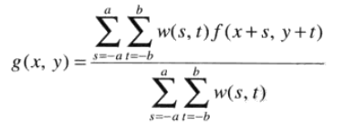

#灰度变换与空间滤波
##一：背景知识
本章主要是空间域处理方法。定义处理方式为：  
	
	g(x,y) = T[f(x,y)];
	
###1.1 空间滤波器
定义T为逐像素的处理模板。该处理通常从输入图像的左上角开始，以水平扫描的方式逐渐处理像素，每次一行。当该邻域的原点位于图像边界上时，部分邻域将位于图像外部。此时，不是在用T做指定的计算时忽略外侧邻点就是用0或者其他指定的灰度值填充图像的边缘。  
  
###1.2 灰度变换
最小邻域大小为1x1时，g仅取决于点(x,y)处的f值。此时可写为：  
	
	s = T(r)

此时技术有:对比度拉伸和阈值处理(二值化)。 使用灰度变换函数可以增强图像，也可以用来分割图像。    
  
>如果结果只涉及一个点的处理方法叫点处理技术，涉及领域点的叫做邻域处理技术。

##二：灰度变换
###2.1 图像反转
对于灰度级别为[0,L-1]的图像，其反转图像：  
	
	s = L-1-r

图像反转特别适用于增强嵌入图像暗色区域中的白色或灰色细节，特别是当黑色面积在尺寸上占主导地位时。  
###2.2 对数变换与反对数变换
对数变换通用形式:  
	
	s = clog(1+r)
  
**对数变换：**将输入中范围较窄的低灰度值映射为输出中范围较宽的灰度值；或将输入中范围较宽的高灰度值映射为输出中范围较窄的灰度值。(扩展暗像素，压缩亮像素)。  
**反对数变换：**与对数变换相反。  
  
###2.3 幂律(伽马)变换
	
	s = cr^γ
	
与对数变换相似，可用于**伽马校正**。  
  
###2.4 分段线性变换
####2.4.1 对比度拉伸
  
####2.4.2 灰度级分层
  
####2.4.3 比特平面分层
  
  
##三：直方图处理
直方图处理也属于灰度图像处理。灰度级为[0,L-1]的图像直方图为离散函数:    
	
	h(rk) = nk
	// normalize
	p(rk) = nk/(MN)
	
其中rk为第k级灰度，nk为rk级灰度的像素点个数，归一化为p(rk)。简单来说：**p(rk)是灰度级rk在图像中出现的概率估计**。归一化直方图的所有分量之和应该等于1。  
若一幅图像的像素倾向于占据整个可能的灰度级并且分布均匀，则该图像会有高对比度的外观并展示灰色调的较大变动。  
###3.1 直方图均衡
为了使直方图通过灰度处理均衡，做如下假设:  
	
	s = T(r), 0<=r<=L-1
	假设:
	1. T(r)在区间0<=r<=L-1上为单调递增函数；  —— 保证明亮对比性不变
	2. 当0<=r<=L-1时，0<=T(r)<=L-1。 —— 保证变化范围相同

可见此映射为非线性的。为了寻求T,通过一系列涉及PDF、CDF的数学推导，最后选取累积分布(CDF)为均衡规则，离散形式为:  
  
>直方图均衡化能自动确定变换函数，其结果大约满足均匀分布。  
###3.2 直方图匹配(规定化)
按照固定的直方图形状去处理图像，而不是均衡处理。  
......  
  
##四：空间滤波
空间滤波由一个邻域对该邻域所包围的图像像素执行的预定义操作组成。如果执行的是线性操作，则称为**线性空间滤波器**,否则称为**非线性空间滤波器**。  
  
  
>执行空间滤波的操作为相关，卷积与此类似，但需要首先反转180度。要了解和区分相关和卷积概念。
###4.1 平滑空间滤波器
平滑滤波器用于模糊处理和降低噪声。(会淡化细节部分)。  
####4.1.1 平滑线性滤波器
均值滤波器和加权均值滤波器。  

一幅MxN的图像经过大小为mxn(m和n为奇数)的加权均值滤波器过程：  
  
####4.1.2 统计排序(非线性)滤波器
中值滤波器、最大值滤波器、最小值滤波器等。  
>其中中值滤波最常用，且对处理脉冲噪声非常有效，这种噪声也称为椒盐噪声。
###4.2 锐化空间滤波器
锐化处理的主要目的是突出灰度的过渡部分，突出细节或增强被模糊的细节。(与平滑空间滤波相反)。  
一阶微分：  
  
二阶微分：  
  
####4.2.1 使用二阶微分进行图像锐化——拉普拉斯算子
拉普拉斯算子：  
  
  
使用拉普拉斯算子对图像增强的基本方法：  
  
c=-1:中心为负；c=1:中心为正。  
计算模板(Laplace算子)：  
  
####4.2.2 使用一阶微分进行图像锐化(非线性)——梯度
梯度计算:  
  
  
  
  
计算模板(Sobel算子)：  

		  

