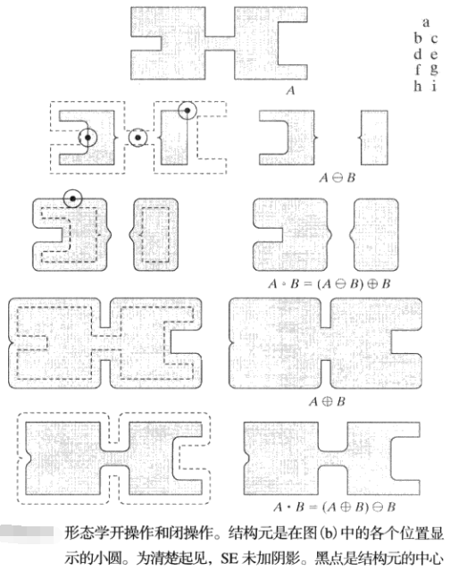
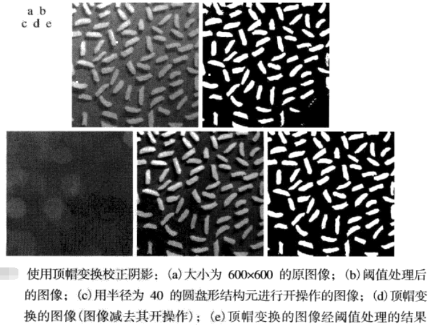

#第九章 形态学图像处理
形态学图像处理将数学形态学作为工具从图像中提取表达和描绘区域形状的有用图像分量，如边界、骨架和凸壳等。一开始将讨论 **二值图像** 的处理，之后将扩展到 **灰度图像**。  

##一：腐蚀和膨胀
###1.1 腐蚀
B对A的腐蚀是一个用z平移的B包含在A中的所有的点z的集合：  
  
  
  
腐蚀缩小或细化了二值图像中的物体，可以将腐蚀视为形态学滤波操作，这种操作将小于结构元的图像细节从图像中滤除(去除)。  
###1.2 膨胀
膨胀的定义为：  
  
  
  
最简单的膨胀应用之一是连接裂缝。  
>膨胀和腐蚀彼此关于集合求补运算和反射运算是对偶的。

##二：开操作与闭操作
膨胀会扩大一幅图像的组成部分，而腐蚀会缩小一幅图像中的组成部分。开操作一般会平滑物体的轮廓、断开较窄的狭颈并消除较细的突出物。闭操作同样也会平滑轮廓的一部分，但与开操作相反，它通常会弥合较窄的间断和细长的沟壑，消除较小的孔径，填补轮廓线中的断裂。  
  
  
  
>开操作和闭操作彼此关于集合求补和反射也是对偶的。  
  
##三：击中或击不中变换
形态学击中或击不中变换是形状检测的基本工具。  
  
  
  
  
  
##四：一些基本的形态学算法
###4.1 边界提取
表示为B(A)的集合A的边界可以通过先用B对A腐蚀，而后执行A和腐蚀的结果之间的差集得到：  
  
  
  
###4.2 孔洞填充
孔洞定义为由前景像素连接的边界所包围的背景区域。  
  
  
###4.3 连通分量的提取
    
  
###4.4 凸壳
  
###4.5 细化
  
###4.6 粗化
  
###4.7 骨架
  
  
###4.8 裁剪
裁剪方法本质上是对细化和骨架算法的补充，因为这些过程会保留某些寄生部分，因而需要用后处理来清除这些寄生部分。  
  
  
  
  
###4.9 形态学重建
形态学重建涉及两幅图像和一个结构元。一幅图像是标记，它包含变换的起始点，另一个图像是模板，它用来约束该变换。  
####4.9.1 测地膨胀和腐蚀
形态学重建的核心是测地腐蚀和测地膨胀。  
测地膨胀以及F关于G的大小为n的测地膨胀定义为：  
    
  
测地腐蚀以及F关于G的大小为n的测地腐蚀定义为：  
  
  
####4.9.2 用膨胀和腐蚀的形态学重建
  
迭代k次，直至：  
  
  
##五：灰度级形态学
将之前的形态学讨论从二值图像处理扩展到灰度级图像。  
###5.1 腐蚀和膨胀
腐蚀和膨胀：  
  
  
非平坦结构元bN对图像的腐蚀和膨胀：  
  
  
>如二值情况那样，腐蚀和膨胀是关于函数的补集和反射对偶的。  
###5.2 开操作和闭操作
  
  
###5.3 一些基本的灰度级形态学算法
####5.3.1 形态学平滑
  
####5.3.2 形态学梯度
  
  
####5.3.3 顶帽变换和底帽变换
  
  
  
####5.3.4 粒度测定
  
####5.3.5 纹理分割
  
###5.4 灰度级形态学重建
与二值图像的重建基本类似。测地膨胀和测地腐蚀：  
  
  
  
  

