#第五章 图像复原与重建
**图像增强**主要是一个主观过程，根据人类视觉系统的生理特点为观察者提供一个便于观察的图像。而**图像复原**大部分是一个客观过程，它试图利用退化现象的某种先验知识来复原被退化的图像。因而，复原技术是面向退化模型的，并且采用相反的过程进行处理，以便恢复出图像。  

##一：图像退化/复原过程模型
如果退化函数H是一个线性的、位置不变的过程，那么空间域的退化函数：  
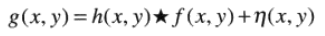  
频率域：  
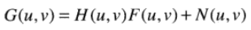  
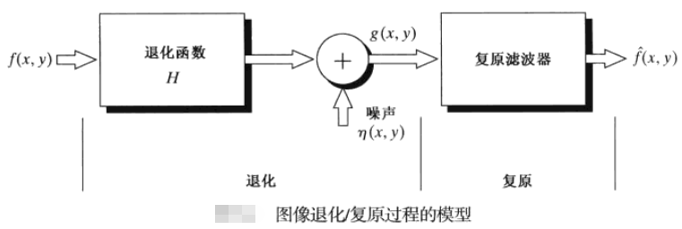  
接下来分两部分讨论：  
1. 假设H是一个同一性的算子，并且只处理由噪声N引起的退化；  
2. 由H和N引起的退化。  

##二：只由噪声引起的退化
###2.1 噪声模型
####2.1.1 一些重要的噪声概率密度函数(PDF)
**以下为空间无关噪声：**  
高斯噪声：  
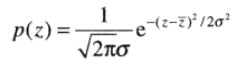  
瑞利噪声：  
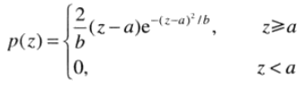  
爱尔兰(伽马)噪声：  
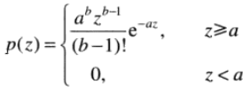  
指数噪声：  
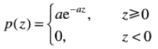    
均匀噪声：  
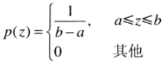    
脉冲(椒盐)噪声：  
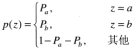  
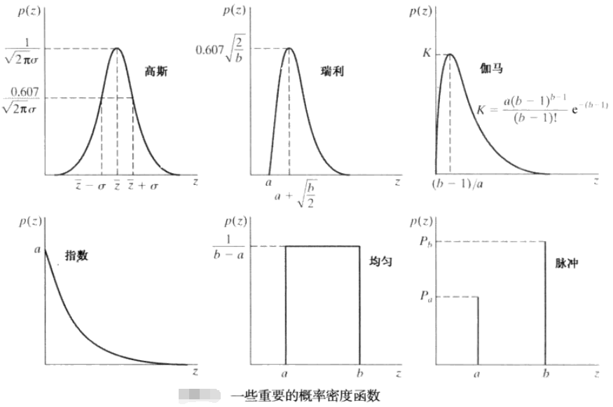  
**空间相关噪声：**  
周期噪声。周期噪声可以通过频率域滤波来显著减少。    
####2.1.2 噪声参数估计
确定噪声类型，并计算噪声参数。其中，周期噪声的参数通常是通过检测图像的傅里叶谱来计算的。    
###2.2 只存在噪声的复原——空间滤波
当一幅图中唯一存在的退化是噪声时：  
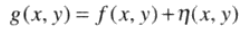  
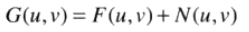  
可以采用空间滤波的方式复原图像。  
####2.2.1 均值滤波器
算术均值滤波器：  
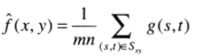  
几何均值滤波器：  
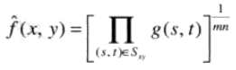  
谐波均值滤波器：  
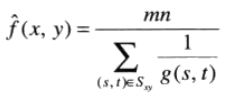  
逆谐波均值滤波器：  
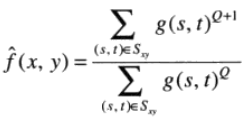  
####2.2.2 统计排序滤波器
中值滤波器：  
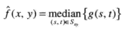  
最大值和最小值滤波器：  
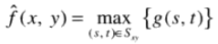  
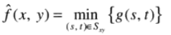  
中点滤波器：  
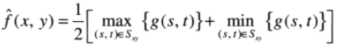  
修正的阿尔法均值滤波器：  
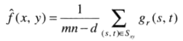  
####2.2.3 自适应滤波器
自适应滤波器效果最好，但结构也相对复杂。  
自适应局部降低噪声滤波器：  
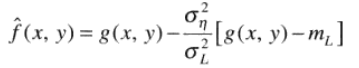  
自适应中值滤波器：  
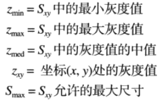  
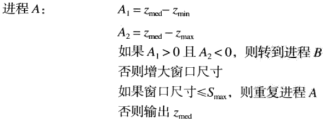  
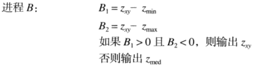  
###2.3 频率域滤波消除周期噪声
使用频率域技术可以有效地分析并滤除周期噪声。  
带阻滤波器(HBR):  
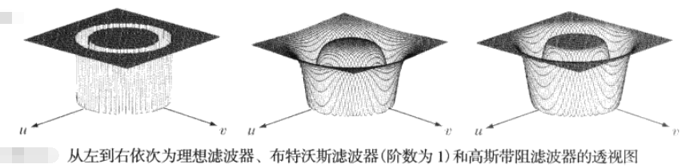  
带通滤波器(HBP):  
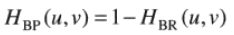  
陷波滤波器(HNP):  
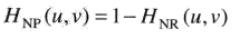  
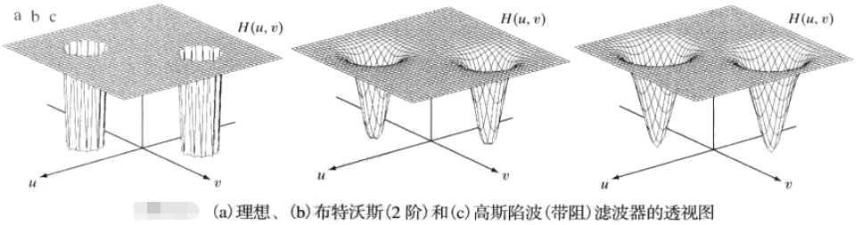  
最佳陷波滤波器：  
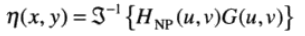  
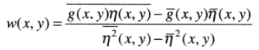  
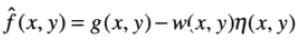  

##三：由退化函数和噪声引起的退化
###3.1 退化函数 
####3.1.1 线性、位置不变的退化
  
  
  
  
####3.1.2 估计退化函数
1. 观察法；  
2. 试验法；  
3. 数学建模法。  
###3.2 滤波 
####3.2.1 逆滤波
得到退化函数H之后，最简单的复原方法是直接做你逆滤波：  
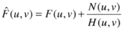  
####3.2.2 最小均方误差(维纳)滤波
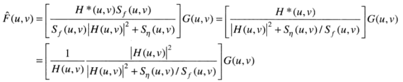  
####3.2.3 约束最小二乘方滤波
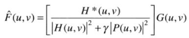  
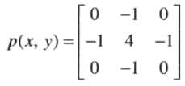  
其中，P(u,v)是p(x,y)的傅里叶变换。  
####3.2.4 几何均值滤波
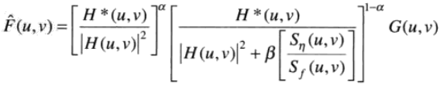  
