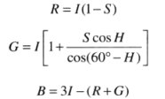
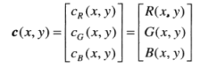

#第六章 彩色图像处理
##一：颜色模型
###1.1 RGB彩色模型
每种颜色出现在红、绿、蓝的原色光谱分量中。RGB原色值位于3个角上；二次色青色、深红色和黄色位于另外3个角上，黑色位于原点处，白色位于远离远点最远的角上。该模型中，灰度沿着连接这两点的直线从黑色延伸到白色。假定所有的颜色值都归一化了。  
  
###1.2 CMY和CMYK彩色模型
RGB模型为光的三基色，CMY描述的是颜料的三原色；一般应用于彩色打印机和复印机等。可由RGB转换得到(已经归一化)：  
  
等量的颜料原色青色、深红色和黄色可以生成黑色，但产生的黑色是不纯的，因此加入第四种颜色——黑色，构成CMYK彩色模型，及“四色打印”。  
###1.3 HSI彩色模型
RGB模型、CMY模型和其他类似的彩色模型都无法很好地适应人类实际上解释的颜色。因此，使用 **色调、饱和度和亮度(HSI)** 来描述物体，可以很好地符合人类视觉。
  
###1.4 色彩转换
RGB->HSI:  
    
  
  
HSI->RGB:  
1. 0<=H<120:  
  
2. 120<=H<240:  
  
  
3. 240<=H<360:  
  
  
  
##二：彩色图像处理基础
###2.1 伪彩色图像处理
伪彩色图像处理指基于一种指定的规则对灰度值赋以颜色的处理。伪彩色的主要应用是人目视视察和解释单幅图像或序列图像中的灰度级事件。(灰度图像->灰度分层处理->彩色图像)。  
####2.1.1 灰度分层
  
  
####2.1.2 灰度到彩色变换
  
  
###2.2 全彩色图像处理
令c代表RGB彩色空间的一个任意向量：  
  
c的分量仅是一幅彩色图像在一点处的RGB分量，可以认为彩色分量是坐标(x,y)的函数：  
  
即把彩色图像分解为各分量的灰度图像。  
  

##三：彩色图像处理
###3.1 彩色变换
彩色变换主要涉及在单一色彩模型内处理彩色图像的分量，而不是这些分量在不同模型间的转换。  
  
  
**主要思路还是将彩色图像的各分量分开，以灰度图像处理的方式分别处理。**  
1. 补色；  
2. 彩色分层；  
3. 色调和彩色矫正；  
4. 直方图处理；  
5. 平滑和锐化；  
6. 基于彩色的图像分割。    
###3.2 平滑和锐化
平滑：  
  
  
锐化：  
  
###3.3 基于彩色的图像分割
1. HSI彩色空间分割；  
2. RGB向量空间分割；  
3. 彩色边缘检测。  
