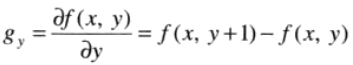

#第十章 图像分割
本章中的多数分割算法均基于灰度值的两个基本性质之一：不连续和相似性。对于不连续的灰度，方法是以灰度突变为基础分割一幅图像，例如边缘。对于相似的灰度，主要方法是根据一组预定义的准则把一幅图像分割为相似的区域，例如阈值处理、区域增长、区域分裂和区域聚合。  
  
##一：点、线和边缘检测
###1.1 背景知识
一阶导数：  
  
二阶导数：  
  
在增强细节方面，二阶导数远强于一阶导数：  
1. 一阶导数通常在图像中产生较粗的边缘；  
2. 二阶导数对精细细节，如细线、孤立点和噪声有较强的响应；  
3. 二阶导数在灰度斜坡和灰度台阶过渡处会产生双边缘响应；  
4. 二阶导数的符号可用于确定边缘的过渡是从亮倒暗还是从暗到亮。  
###1.2 孤立点的检测
孤立点的检测应以二阶导数为基础，使用拉普拉斯算子：  
  
  
  
###1.3 线检测
线检测同样可以使用拉普拉斯模板，但拉普拉斯检测子是各向同性的，因此其响应与方向无关，也可以使用与方向有关的改进算子：  
  
###1.4 边缘模型
1. 台阶模型；  
2. 斜坡模型；
3. 屋顶边缘模型。  
  

一阶导数的幅度可用于检测图像中的某个点处是否存在一个边缘。二阶导数的符号可用于确定一个边缘像素是位于该边缘的暗侧还是亮侧。二阶导数的附加性质：  
1. 对图像中的每条边缘，二阶导数生成两个值；  
2. 二阶导数的零交叉点可用于定位粗边缘的中心。  
  
###1.5 基本边缘检测
####1.5.1 梯度及性质
  
  
####1.5.2 梯度算子
一维模板：  
  
  
  
Roberts：  
  
  
  
Prewitt：  
  
  
  
Sobel：  
  
  
  
用于检测对角线边缘的Prewitt和Sobel：  
  
###1.6 更先进的边缘检测技术
####1.6.1 Marr-Hildreth边缘检测器
高斯拉普拉斯LoG：  
  
  
  
####1.6.2 坎尼边缘检测器
  
###1.7 边缘连接和边界检测
理想情况下，边缘检测应该仅产生位于边缘上的像素集合。实际上，由于噪声、不均匀照明引起的边缘间断，以及其他引入灰度值虚假的不连续的影响，这些像素并不能完全描述边缘特性。因此，一般是在边缘检测后紧跟连接算法，将边缘像素组合成有意义的边缘或区域边界。  
  
##二：阈值处理
图像阈值处理在图像分割应用中处于核心地位。  
###2.1 基本的全局阈值处理
  
###2.1 用Otsu方法的最佳全局阈值处理
  
  
##三：区域分割
###3.1 基于区域的分割
####3.1.1 区域生长
  
####3.1.2 区域分割与聚合
  
###3.2 用形态学分水岭的分割
###3.3 分割中运动的应用  
  

