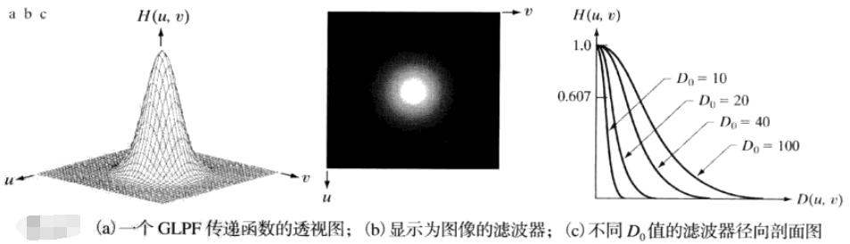

#第四章 频率域滤波
##一：单变量离散傅里叶变换(DFT)
  
  

##二：二维离散傅里叶变换(DFT)
  
  
DFT性质:  
1. 平移和旋转；  
2. 周期性；  
3. 对称性；  
4. 傅里叶谱和相角；  
5. 二维卷积定理。  

##三：频率域滤波
**高频：** 代表图像变化较快的部分，细节丰富，例如边缘等；  
**低频：** 代表图像变化缓慢的部分，图像总体信息和主要部分。  
频率域滤波是以如下处理为基础的：**修改傅里叶变换以达到特殊目的，然后计算IDFT(傅里叶反变换)返回到图像域。**一般平滑图像使用低通滤波器，而锐化图像使用高通滤波器。    
>频率域与时域的联系是卷积定理。  
###3.1 使用频率域滤波器平滑图像
####3.1.1 理想低通滤波器(ILPF)
以原点为圆心，D0为半径的圆内，无衰减地通过所有频率，而在圆外“阻断”所有频率的二维低通滤波器称为“理想低通滤波器(ILPF)”：  
  
其中D0为一个正常数，D(u,v)是频率域中点(u,v)与频率矩形中心距离，也叫欧氏距离：  

  
>ILPF的模糊和振铃性，可以用卷积定理解释。    
####3.1.2 布特沃斯低通滤波器(BLPF)
截止频率位于距原点D0处的n阶布特沃斯低通滤波器(BLPF)的传递函数定义为：  
  
  
####3.1.3 高斯低通滤波器(GLPF)
高斯低通滤波器:  
  
  
###3.2 使用频率域滤波器锐化图像
####3.2.1 理想高通滤波器(IHPF)
理想高通滤波器：  
  
  
####3.2.2 布特沃斯高通滤波器(BHPF)
  
  
####3.2.3 高斯高通滤波器(GHPF)
    
  
####3.3.3 频率域拉普拉斯算子
对应时域使用二阶微分对图像进行锐化操作，由时域的拉普拉斯算子得频率域的拉普拉斯算子：  
  
  
  
  
###3.3 选择性滤波
带阻滤波器、带通滤波器、陷滤波器等。  
  
##四：实现
1. 二维DFT可分性：f(x,y)的二维DFT可通过计算f(x,y)的每一行的一维变换，然后沿计算结果的每一列计算一维变换得到。  
2. 使用DFT算法计算IDFT。  
3. 快速傅里叶变换FFT。  

